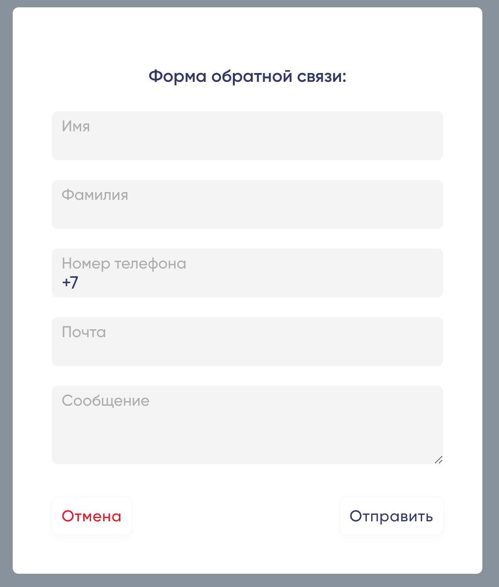
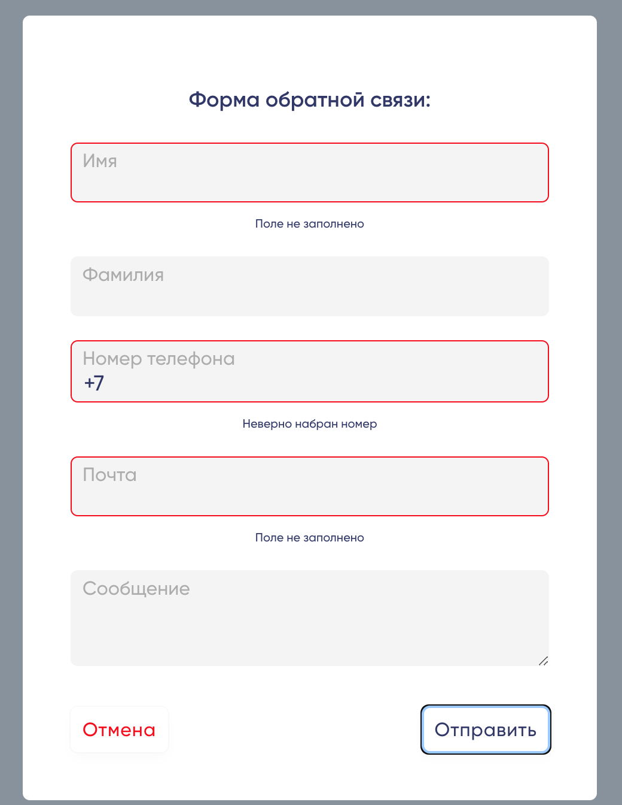
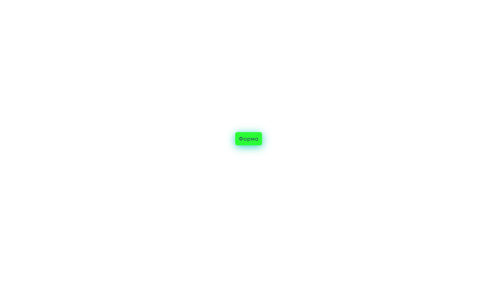
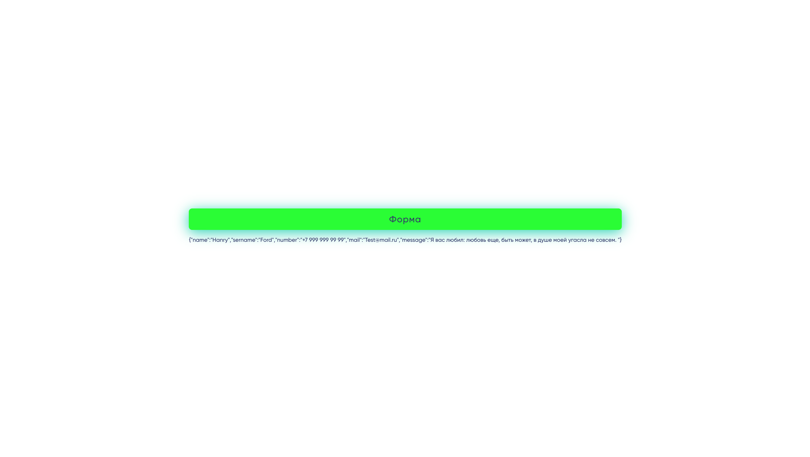

# temperature sensor

P.S. This repository contains the temp-sensor project developed by Igor Kobozev.

###### Tech: Vue 3 + TypeScript + Vite

## initialization
 node -v >16.14.0
```
npm i
```
```
npm run dev
```

## Функционал:
> В произвольной верстке, на VUE3, реализована модальное окно, состоящее из полей, используя БЭМ нейминг:
>
>
>
>> * Имя (обязательное поле, максимум 100 символов)
>> * Фамилия(максимум 100 символов)
>> * Почта (обязательное) 
>> * Сообщение(максимум 500 символов).
>> * Телефон - только российские номера
>> * Подключена валидация полей.
>>

>###### Произвольная верстка:
>
>
>###### После отправки формы:
>
>
>> Снизу кнопки появляется объект отправки данных.

## Архитектура:
Поля в компоненте гинерируются с помощью полей объекта Fields, разберем на примере объекта number:
```
  number: {
    label: "Номер телефона", // placeholder/Label
    value: "", // значение инпута
    bind: { // объект который bind-ит доп поля
      type: FieldTypes.phone, // enum, тип инпута
      required: true, // добавлет атрибут инпуту
      maxLength: 12, // максимальная длина инпута
    },
    isValid: true, // показывается ошибка / нет
    errorText: '', // текст ошибки
    errors: { // проверки валидации
      valid: {
        checkFunc: function (value: string) { // функция проверки
        const regExp = /^(?:\+7|8)\d{10}$/;
        return regExp.test(value.replace(/[ ()-]/g, ""));},
       text: 'Неверно набран номер', // текст в случае ошибки
    },
		require: {
			checkFunc: function (value: string) {
			return Boolean(value.length);
			},
			text: 'Поле не заполнено',
		},
    },
  },
```